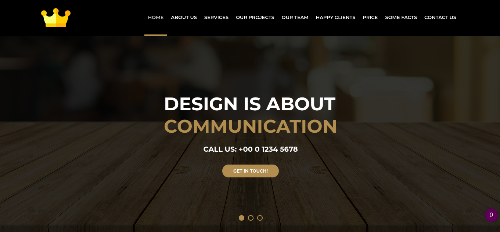
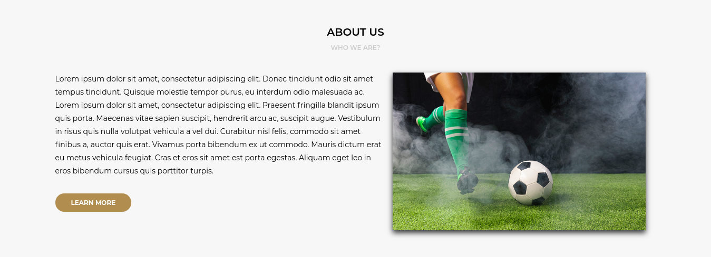
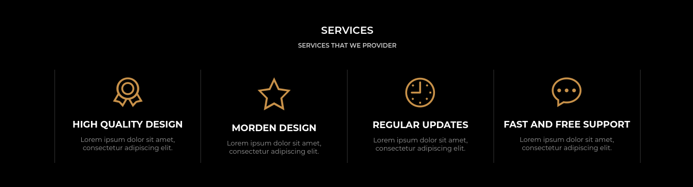
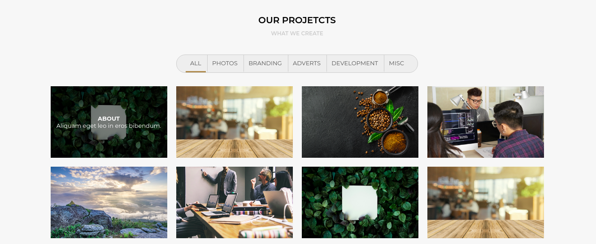
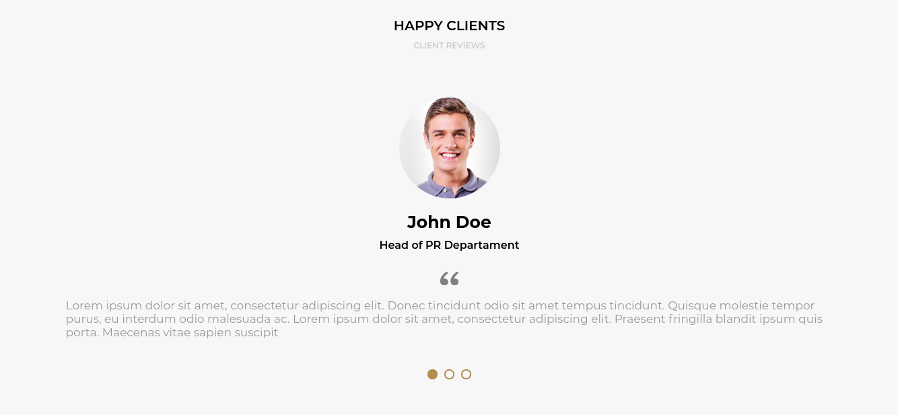
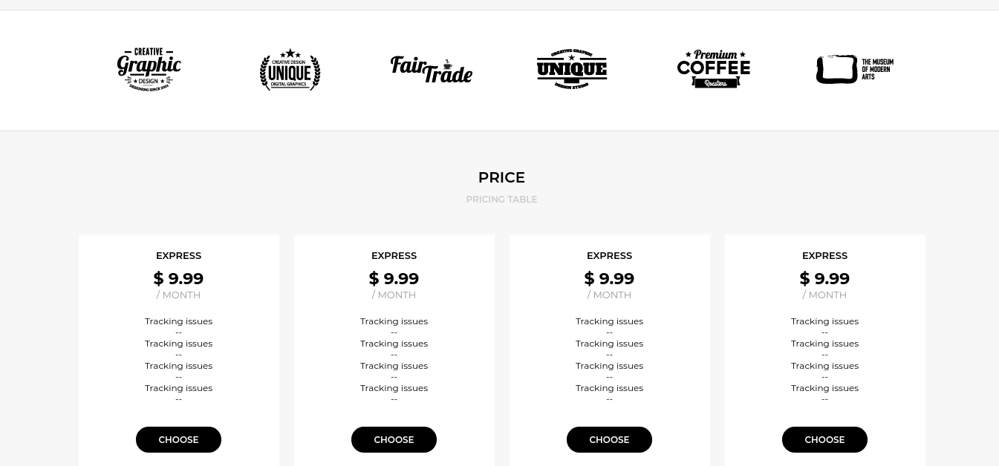
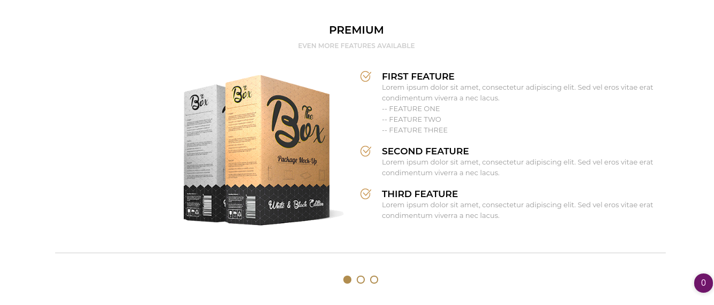
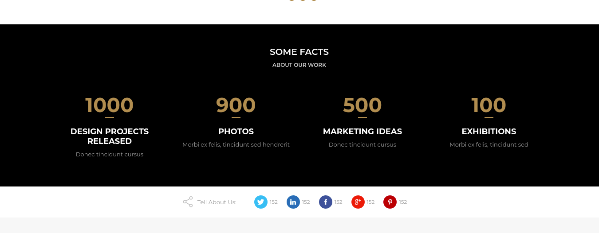
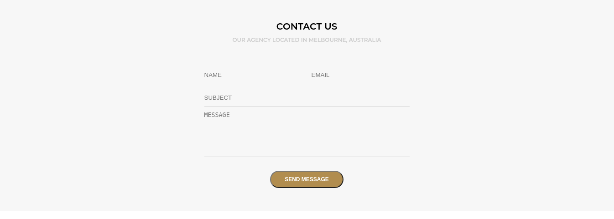
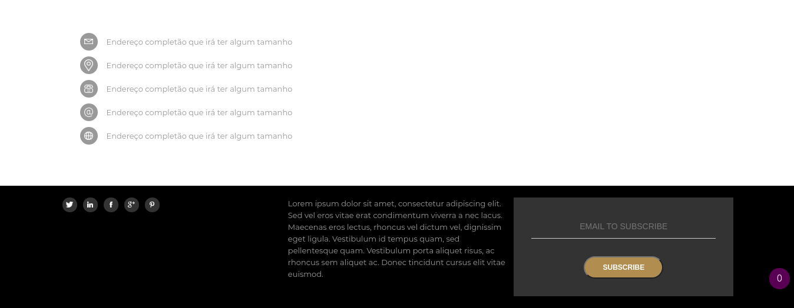

### Projeto AWAX site desenvolvido para o treinamento em HTML 5 e CSS 3
- Projeto que retrada um site.

### Projeto publicado: 
- http://awax.tfcoder.com/

## <b>Header / Carrosel</b>

## <b>ABOUT US</b>

## <b>SERVICES</b>

## <b>OUR PROJECTS</b>

## <b>OUR TEAM</b>

## <b>HAPPY CLIENTS</b>

## <b>EMPRESAS</b>

## <b>PREMIUM</b>

## <b>SOME FACTS</b>

## <b>CONTACTS</b>

## <b>FOOTER</b>

